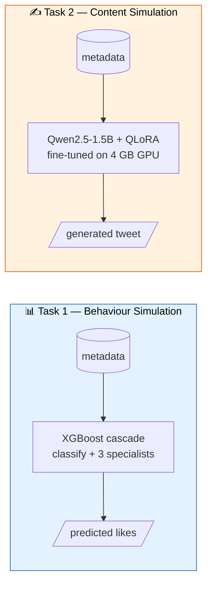

<div align="center">

# 🐦 Tweet Analyzer

### Two tasks, one laptop, four GB of VRAM.

*End-to-end solutions for the **Adobe Behaviour Simulation Challenge** (Inter IIT Tech Meet, Mid Prep 2025) — built entirely on an RTX 3050 Laptop with 4 GB of VRAM.*

[](https://www.python.org/)
[](https://pytorch.org/)
[](https://huggingface.co/transformers)
[](https://xgboost.ai)
[](https://github.com/huggingface/peft)
[](LICENSE)

</div>

---

## 🎯 What's Inside

The Adobe challenge defines two complementary tasks on the same dataset of marketing tweets. This repo ships a **separate, self-contained solution for each**, plus a comparison of multiple modeling approaches per task.



| | **Task 1 — Behaviour Simulation** | **Task 2 — Content Simulation** |
|---|---|---|
| **Input** | `(date, content, company, media URL, username)` | `(date, target likes, company, media URL)` |
| **Output** | Number of likes (integer regression) | Tweet text (generation) |
| **Metric** | RMSE | BLEU 1–4, ROUGE, CIDEr |
| **Model** | XGBoost classifier + 3 specialist regressors | Qwen2.5-1.5B + QLoRA (r=16) |
| **Feature stack** | 32 hand-crafted + 384-dim MiniLM | ChatML prompt + Qwen2.5-VL-3B image caption |
| **Best val score** | **RMSE 2,333.85** (raw likes) | **eval_loss 1.080** (token-level acc 78%) |
| **Folder** | [`Task-1/`](Task-1/README.md) | [`Task-2/`](Task-2/README.md) |

---

## 🏆 Headline Results

### Task 1 — Single regressor vs. cascade head-to-head

| Approach | Val RMSE (raw likes) |
|---|---:|
| Single XGBoost regressor (baseline) | 2,347.89 |
| Cascade — **hard routing** (argmax) | 2,359.96 |
| **Cascade — soft routing (shipped) 🏆** | **2,333.85** |
| Cascade — oracle (perfect classifier) | 2,023.77 |

The shipped cascade probability-weights three specialist regressors. Full methodology + ablation in [`Task-1/REPORT.md`](Task-1/REPORT.md).

### Task 2 — QLoRA on 4 GB

| Checkpoint | Eval loss | Token accuracy |
|---|---:|---:|
| Step 500 | 1.093 | 78.25% |
| **Step 1000 (shipped) 🏆** | **1.080** | **77.96%** |

Sample generation (unseen time period, **BlackBerry**):

> *"We're excited to announce the launch of the #BlackBerry 1000, the world's first #5G mobile device. Learn more: `<hyperlink>`"*

Full sample showcase + architecture decisions in [`Task-2/README.md`](Task-2/README.md).

---

## 🛠️ The "4 GB Laptop" Constraint

Most ML papers in this space quietly assume a 24 GB datacenter GPU. We had a **laptop with 4 GB**. The interesting engineering — visible across both tasks — is what we did to make it fit:

| Trick | Task 1 | Task 2 |
|---|:-:|:-:|
| 4-bit NF4 quantization (bitsandbytes) | — | ✅ (1.5B model in ~1 GB) |
| Paged 8-bit AdamW optimizer | — | ✅ (CPU-paged momentum) |
| Gradient checkpointing | — | ✅ (−30% activations) |
| Custom VRAMGuard callback (≥98% threshold) | — | ✅ (no throughput cost) |
| Sequential model loading (VLM frees before LLM loads) | — | ✅ |
| Small Sentence-Transformer (MiniLM-L6-v2 over BGE-Base) | ✅ | — |
| Sequential CPU-friendly XGBoost training | ✅ | — |
| Regime-mirroring train/val split | ✅ | ✅ |

Both pipelines run end-to-end in **under 5 minutes** on the same RTX 3050 Laptop.

---

## 🚀 Quick Start

```bash
git clone https://github.com/havish-coder/Tweet_analyzer.git
cd Tweet_analyzer

# ---- Task 1: tweet likes prediction ----
cd Task-1
pip install -r requirements.txt
python 01_features.py
python 02_embed.py
python 03b_train_class_reg.py
python 04b_predict_class_reg.py
# → Task-1/outputs/submission_company.xlsx
# → Task-1/outputs/submission_time.xlsx

# ---- Task 2: tweet text generation ----
cd ../Task-2
pip install -r requirements.txt
python src/eval.py
# → Task-2/outputs/submission_unseen_brands.csv
# → Task-2/outputs/submission_unseen_time.csv
```

---

## 📁 Repository Layout

```
Tweet_analyzer/
├── README.md                          ← you are here (overview, both tasks)
├── LICENSE                            MIT
├── .gitignore
│
├── Task-1/                            📊 Tweet Likes Prediction (RMSE)
│   ├── README.md                      Polished overview + mermaid diagram
│   ├── REPORT.md                      Single-regressor vs. cascade comparison
│   ├── requirements.txt
│   ├── 01_features.py                 Feature engineering
│   ├── 02_embed.py                    MiniLM embeddings
│   ├── 03_train.py                    Baseline single regressor
│   ├── 03b_train_class_reg.py         🏆 Cascade training
│   ├── 04_predict.py                  Baseline inference
│   ├── 04b_predict_class_reg.py       🏆 Cascade inference
│   ├── data/                          Train CSV + test xlsx files
│   ├── models/                        Trained joblib artifacts
│   └── outputs/                       Submission xlsx files
│
└── Task-2/                            ✍️ Tweet Text Generation (BLEU/ROUGE/CIDEr)
    ├── README.md                      Polished overview + mermaid diagram
    ├── explain.md                     Interview prep guide (Q&A format)
    ├── requirements.txt
    ├── src/                           5-stage pipeline (VLM → LLM)
    │   ├── enrich_vlm.py              Stage 1: Qwen2.5-VL-3B captioning
    │   ├── prep_llm_data.py           Stage 2: ChatML JSONL builder
    │   ├── prompt_utils.py            Shared prompt template
    │   ├── finetune_qwen.py           Stage 3: QLoRA fine-tuning
    │   └── eval.py                    Stage 4: beam-search inference
    ├── data/                          Train + test CSVs + JSONL
    ├── adapter/                       Trained LoRA adapter (~20 MB)
    ├── outputs/                       Generated tweet submissions
    └── docs/                          Deep-dive technical write-up
```

---

## 📐 Common Threads Across Both Tasks

### 1. Regime-mirroring train/val splits
The competition tests on **unseen brands** and **unseen time periods** — two distinct generalization regimes. Both tasks build a val set that holds out 5% of brands *and* the latest 5% of dates. Val metrics now correlate with leaderboard performance, not random in-distribution noise.

### 2. Shared prompt/feature utilities (train ≡ inference)
- Task 1: `TabularFeatureBuilder(is_train=True/False)` is imported by both training and prediction. Feature drift is structurally impossible.
- Task 2: `prompt_utils.build_messages()` is imported by both `prep_llm_data.py` and `eval.py`. A one-token prompt drift would drop BLEU by 5+ points — we eliminated that risk.

### 3. Honesty over score-chasing
Both tasks include **comparisons against a simpler baseline** and **explicit failure-mode write-ups** instead of cherry-picking the winning architecture:
- Task 1's [`REPORT.md`](Task-1/REPORT.md) ships head-to-head with hard/soft routing + oracle bounds.
- Task 2's [`docs/DEEP_DIVE.md`](Task-2/docs/DEEP_DIVE.md) documents the bugs hit + fixed, in chronological order.

### 4. Long-tail / heavy-imbalance handling
- Task 1: power-law `likes` → `log1p` transform + class-weighted classifier.
- Task 2: instruction-tuned ChatML format + beam search to capture mode of the reference distribution.

---

## 📜 License & Credits

- **Code:** [MIT](LICENSE)
- **Dataset:** Open-source. IP of the final solution belongs to Adobe per the challenge terms.
- **Models used (all open-weights):**
  - [Qwen2.5-1.5B-Instruct](https://huggingface.co/Qwen/Qwen2.5-1.5B-Instruct) (Alibaba)
  - [Qwen2.5-VL-3B-Instruct](https://huggingface.co/Qwen/Qwen2.5-VL-3B-Instruct) (Alibaba)
  - [all-MiniLM-L6-v2](https://huggingface.co/sentence-transformers/all-MiniLM-L6-v2) (Sentence-Transformers)
- **Frameworks:** PyTorch · Transformers · PEFT · TRL · bitsandbytes · XGBoost · scikit-learn

Built for the **Adobe Behaviour Simulation Challenge** — Inter IIT Tech Meet, Mid Prep 2025 · IIT Madras.

---

<div align="center">

*Built on a laptop. Designed to ship.*

</div>
