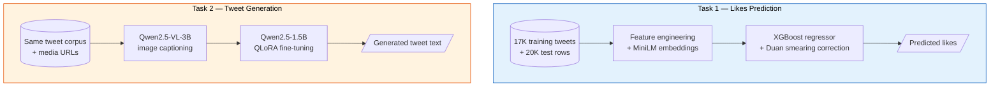

# Tweet Analyzer

A project under **Google Developer Student Club, IIT Indore** — end-to-end solutions for the **Adobe Behaviour Simulation Challenge** (Problem Statement: Inter IIT Tech Meet, Mid Prep 2023), built entirely on a system with 4 GB of VRAM.

## What's Inside

The Adobe challenge defines two complementary tasks on the same dataset of marketing tweets. This repo ships a separate, self-contained solution for each.

| | Task 1 — Behaviour Simulation | Task 2 — Content Simulation |
|---|---|---|
| **Input** | `(date, content, company, media URL, username)` | `(date, target likes, company, media URL)` |
| **Output** | Number of likes (integer regression) | Tweet text (generation) |
| **Metric** | RMSE | BLEU 1-4, ROUGE, CIDEr |
| **Feature stack** | 32 hand-crafted + 384-dim MiniLM | ChatML prompt + Qwen2.5-VL-3B image caption |
| **Model** | XGBoost regressor + smearing correction (7-bucket cascade kept as ablation control) | Qwen2.5-1.5B-Instruct + LoRA r=16 |
| **Folder** | [`Task-1/`](Task-1/README.md) | [`Task-2/`](Task-2/README.md) |



## Achievements

### Task 1 — Likes Prediction

Graded on the 20,000-row competition test set (10K unseen brands + 10K unseen time). The model was improved iteratively; both submissions are reported.

| Metric | First submission (cascade) | Current model (regressor + smearing) |
|---|---:|---:|
| RMSE — Unseen Brands | 963.27 | **620.83** |
| RMSE — Unseen Time | 2,208.23 | **1,861.01** |
| MAE — Unseen Brands | 452.87 | **350.39** |
| MAE — Unseen Time | 590.94 | **565.46** |
| Median absolute error | 136 | 137 |
| Predictions within 5x of actual | — | 80.2% |

The current model was selected by an ablation on a leak-free, regime-mirrored validation split (single regressor + Duan smearing 2,240 vs cascade 2,341), and the validation choice was confirmed independently on both test regimes.

**Baseline context.** Constant predictors derived from the training set, graded on the same test rows:

| Predictor | Unseen Brands RMSE | Unseen Time RMSE | Combined (20K) |
|---|---:|---:|---:|
| Predict train median (73) | 398.9 | 2,551.6 | 1,826 |
| Predict train mean (718) | 434.2 | 2,498.8 | 1,793 |
| **Current model** | **620.83** | **1,861.01** | **1,387** |

Combined, the model beats the best constant baseline by **23%**. On unseen time it adds unambiguous value — 26% lower RMSE than any constant, with strong per-tweet ranking (Spearman 0.72), driven by brand-history priors. On unseen brands, metadata carries almost no per-tweet ranking signal (Spearman ≈ 0.02, a property of the task: virality depends on follower counts absent from the data); the model's contribution there is level calibration — it beats every constant on log-RMSE (0.99 vs 1.08) while a constant wins on raw RMSE over that regime's narrow distribution.

### Task 2 — Tweet Generation

Seeded random 500-sample evaluation per regime, metadata-only input (the model never sees the reference tweet). The un-fine-tuned base model, run on the same rows with identical prompts and decoding, provides the baseline.

| Metric (brands / time) | Base Qwen2.5-1.5B | Fine-tuned |
|---|---:|---:|
| BLEU-1 | 0.075 / 0.083 | **0.176 / 0.133** |
| ROUGE-L | 0.078 / 0.086 | **0.213 / 0.185** |
| CIDEr | 0.014 / 0.015 | **0.086 / 0.081** |
| Eval perplexity (held-out tweets) | 53.5 | **3.3** |
| Avg generation length (refs 16.5 / 19.3) | 27–30 words | 13.7–13.8 words |

Fine-tuning roughly doubles-to-triples every overlap metric (bootstrap 95% CIs do not overlap) and cuts held-out perplexity by 94%.

### Engineering highlights

- QLoRA fine-tune of a 1.5B-parameter LLM on a 4 GB laptop GPU: 4-bit NF4 quantization, paged 8-bit AdamW, gradient checkpointing, and a custom VRAMGuard callback that frees the CUDA cache only when reserved memory crosses 98%.
- Sequential VLM-then-LLM loading so the two models never co-reside in VRAM.
- Leak-proof validation: brand priors and scaler statistics computed from training rows only; early stopping on an inner slice of train; the eval set used purely for reporting.
- Train/inference parity by construction: one shared feature builder (Task 1) and one shared prompt template (Task 2) imported by both training and inference, with id-verified data alignment.
- Batched, left-padded beam-search inference and seeded random evaluation samples with bootstrap confidence intervals.
- Task 1 runs end-to-end (features, embeddings, training, 20K predictions) in about five minutes.

## The 4 GB Laptop Constraint

| Technique | Task 1 | Task 2 |
|---|:-:|:-:|
| 4-bit NF4 quantization (bitsandbytes) | — | Yes (1.5B model in ~1 GB) |
| Paged 8-bit AdamW optimizer | — | Yes (CPU-paged momentum) |
| Gradient checkpointing | — | Yes (~30% activation savings) |
| VRAMGuard callback (98% threshold) | — | Yes (no throughput cost) |
| Sequential model loading (VLM freed before LLM loads) | — | Yes |
| Small sentence-transformer (MiniLM-L6-v2) | Yes | — |
| CPU-friendly XGBoost training | Yes | — |
| Regime-mirroring train/val split | Yes | Yes |

## Quick Start

```bash
git clone https://github.com/havish-coder/Tweet_analyzer.git
cd Tweet_analyzer

# ---- Task 1: tweet likes prediction ----
cd Task-1
pip install -r requirements.txt
python 01_features.py
python 02_embed.py
python 03_train.py
python 04_predict.py
# -> Task-1/outputs/submission_company.xlsx
# -> Task-1/outputs/submission_time.xlsx

# ---- Task 2: tweet text generation ----
cd ../Task-2
pip install -r requirements.txt
python src/eval.py
# -> Task-2/outputs/submission_unseen_brands.csv
# -> Task-2/outputs/submission_unseen_time.csv
```

## Repository Layout

```
Tweet_analyzer/
├── README.md                          overview (both tasks)
├── FINAL_REPORT.md                    graded results for both tasks
├── LICENSE                            MIT
│
├── Task-1/                            Tweet likes prediction (RMSE)
│   ├── README.md                      methodology + results
│   ├── 01_features.py                 feature engineering
│   ├── 02_embed.py                    MiniLM embeddings
│   ├── 03_train.py                    cascade + baseline ablation
│   ├── 04_predict.py                  inference on both test regimes
│   ├── data/                          train CSV + test xlsx files
│   ├── models/                        trained artifacts + metrics.json
│   └── outputs/                       submission files
│
└── Task-2/                            Tweet text generation (BLEU/ROUGE/CIDEr)
    ├── README.md                      methodology + results
    ├── src/
    │   ├── enrich_vlm.py              Qwen2.5-VL-3B media captioning
    │   ├── prep_llm_data.py           ChatML JSONL builder
    │   ├── prompt_utils.py            shared prompt template
    │   ├── finetune_qwen.py           QLoRA fine-tuning
    │   ├── select_checkpoint.py       checkpoint selection by BLEU/ROUGE
    │   ├── gen_metrics.py             metrics + bootstrap CIs
    │   └── eval.py                    inference + submissions
    ├── data/                          train + test CSVs + JSONL
    ├── adapter/                       trained LoRA adapter (~20 MB)
    └── outputs/                       generated submissions
```

## Improvements

Planned enhancements, ordered by expected impact.

**Task 1**
- Rolling brand-history features (recent-N engagement stats, days since last tweet, posting rate, trend) — targets the unseen-time regime, where most of the remaining error lives.
- Prediction capping by brand-history quantiles to trim tail overshoot.
- Hyperparameter search with brand-grouped cross-validation (Optuna + GroupKFold).
- CatBoost with the brand as a native categorical feature, ensembled with XGBoost.
- Residual modeling: predict deviation from the brand prior instead of the absolute target.

**Task 2**
- Retrieval few-shot prompting with the brand's recent tweets (tooling shipped: `EXAMPLES_IN_TRAIN=1` at data prep, `USE_RETRIEVAL=1` at inference), paired with a re-finetune for prompt parity.
- Checkpoint selection by generation metrics (`select_checkpoint.py`) after each training run.
- Captioning live test media with the VLM (most relevant for the recent unseen-time regime).
- Length-calibrated decoding (`LENGTH_PENALTY`, `MIN_NEW_TOKENS`).
- Full 20K-row submission run via batched generation.

## License & Credits

- **Code:** [MIT](LICENSE)
- **Dataset:** Open-source. IP of the final solution belongs to Adobe per the challenge terms.
- **Models used (all open-weights):** [Qwen2.5-1.5B-Instruct](https://huggingface.co/Qwen/Qwen2.5-1.5B-Instruct), [Qwen2.5-VL-3B-Instruct](https://huggingface.co/Qwen/Qwen2.5-VL-3B-Instruct), [all-MiniLM-L6-v2](https://huggingface.co/sentence-transformers/all-MiniLM-L6-v2)
- **Frameworks:** PyTorch, Transformers, PEFT, TRL, bitsandbytes, XGBoost, scikit-learn

Built under **Google Developer Student Club, IIT Indore** (Problem Statement: Adobe Behaviour Simulation Challenge, Inter IIT Tech Meet 2023).
