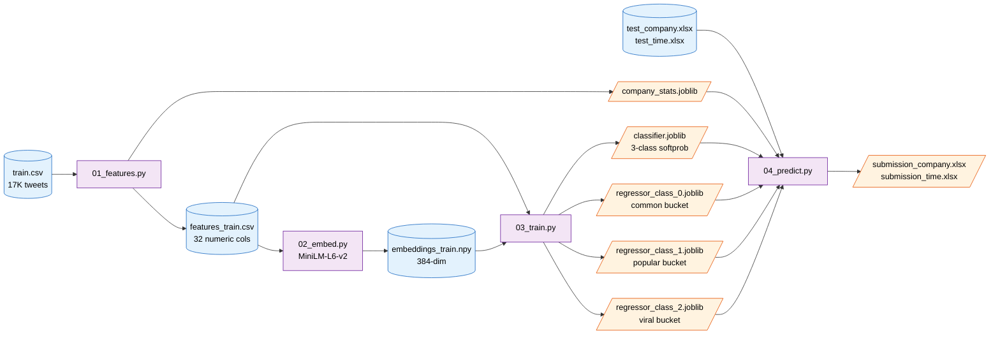

<div align="center">

# 📊 Task 1 — Tweet Likes Prediction

### *Classification-then-Regression*

[](https://www.python.org/)
[](https://xgboost.ai)
[](https://scikit-learn.org)
[](https://www.sbert.net)

[Pipeline](#-pipeline) · [Methodology](#-methodology) · [Results](#-results) · [Reproduce](#-reproduce)

</div>

---

## 📋 TL;DR

| | |
|---|---|
| **What** | Predict the number of likes a tweet will receive from its metadata `(date, content, username, media URL, inferred company)`. |
| **Approach** | **Two-stage cascade** — an XGBoost classifier sorts each tweet into a popularity bucket (common / popular / viral), then three specialist XGBoost regressors fit each bucket's distribution tightly. At inference, predictions are probability-weighted across all three specialists. |
| **Result** | Validation RMSE **2,333.85** on raw likes (log-scale **0.96**), against a regime-mirroring held-out split. |
| **Built for** | Adobe Behaviour Simulation Challenge — Inter IIT Tech Meet (Mid Prep 2025). |

---

## 🔧 Pipeline



<details>
<summary>📐 ASCII fallback</summary>

```
   train.csv  (17K tweets)                    test_company.xlsx
       │                                      test_time.xlsx
       ▼                                              │
 ┌──────────────────┐                                 ▼
 │ 01_features.py   │                       ┌──────────────────────┐
 │  cyclical time,  │           ┌──────────►│ 04_predict.py        │
 │  COVID flag,     │           │           │  per row:            │
 │  media regex,    │           │           │   - features         │
 │  LOO company     │           │           │   - MiniLM embed     │
 └────────┬─────────┘           │           │   - classifier probs │
          │                     │           │   - 3 reg preds      │
          ▼                     │           │   - soft route Σ p·r │
  features_train.csv            │           └──────────┬───────────┘
          │                     │                      ▼
          ▼                     │              submission_*.xlsx
 ┌──────────────────┐           │
 │ 02_embed.py      │           │
 │ MiniLM 384-dim   │           │
 └────────┬─────────┘           │
          │                     │
          ▼                     │
   embeddings_train.npy         │
          │                     │
          ▼                     │
 ┌────────────────────────────┐ │
 │ 03_train.py                │ │
 │  Stage A: XGB classifier   │ │
 │   (3 buckets, class-weighted)│
 │  Stage B: 3 XGB regressors │─┘
 │   (one per bucket, log_likes)
 └────────────────────────────┘
```

</details>

---

## 🧠 Methodology

### The Insight
Likes follow a **power-law distribution** — median 73, max 254,931. A single model trying to fit the entire range gets pulled in different directions by very different regimes (common tweets vs. viral ones). The cascade design lets each regressor specialize in its own slice of the distribution.

### Bucket Definition (training-set quantiles)

| Class | Range | Train rows | Eval rows |
|---|---|---:|---:|
| **0 — Common** | likes < 331 | 12,076 (75%) | 793 |
| **1 — Popular** | 331 ≤ likes < 2,489 | 3,222 (20%) | 344 |
| **2 — Viral** | likes ≥ 2,489 | 806 (5%) | 90 |

### Stage A — XGBoost Classifier
3-class softprob, class-weighted to counteract the 75/20/5 imbalance. Trained with early stopping on the eval set.

**Eval accuracy: 82.2%** with these per-class numbers:

| Class | Precision | Recall | F1 |
|---|---:|---:|---:|
| 0 (common) | 0.900 | 0.881 | 0.890 |
| 1 (popular) | 0.671 | 0.776 | 0.720 |
| 2 (viral) | 0.808 | 0.467 | 0.592 |

> **The viral class has the lowest recall (47%)** — that's the cascade's biggest weakness *and* biggest remaining upside. An oracle (perfect classifier) would drop RMSE another 13%, mostly by catching more viral tweets.

### Stage B — Three Specialist Regressors
Each XGBoost regressor sees only its bucket's rows during training, with `log1p(likes)` as the target. By specializing, each one learns its bucket's distribution tightly instead of trying to fit the whole range.

### Soft Routing — The Inference Step
The naïve cascade picks `argmax(class_probs)` and uses only that bucket's regressor — **hard routing**. The problem: if the classifier is wrong (and it is, 18% of the time), the row goes to a regressor that *never trained on its distribution*. Errors compound.

**Soft routing** weights *all three* regressor predictions by class probability:

$$\hat{y} = \sum_{k=0}^{2} p(k \mid x) \cdot \texttt{expm1}(r_k(x))$$

For uncertain rows, regressor predictions get averaged out → graceful degradation. For confident rows, one term dominates → same answer as hard routing. **Soft routing is hard routing's strict superset** when the classifier is calibrated.

---

## 📐 Feature Engineering

A clean OOP class (`TabularFeatureBuilder`) builds 32 numeric features. The same builder is imported by training and inference — drift between the two is impossible by construction.

### Cyclical Time
```python
self.df["hour_sin"]  = np.sin(2 * np.pi * hour / 24.0)
self.df["hour_cos"]  = np.cos(2 * np.pi * hour / 24.0)
# Same for day_of_week (period 7) and month (period 12)
```
Why: raw `hour=23` and `hour=0` look far apart to a tree split, but they're actually adjacent. Cyclical encoding preserves the wraparound.

### COVID Regime Flag
```python
self.df["is_post_covid"] = (self.df["date"] >= pd.Timestamp("2020-03-01")).astype(int)
```
Engagement patterns shift around March 2020. Explicit binary lets the model learn separate biases instead of having to discover the cutoff itself.

### Media Regex Parsing
The raw `media` column is `[Video(duration=14.0, views=12340, url='...')]`. We extract:
- `video_duration` and `video_views` (+ `log_video_views`)
- `has_photo` / `has_video` / `has_gif` binary flags

These are real engagement signals normally collapsed to a single `has_media=1/0` bit.

### Leave-One-Out Company Prior (anti-leakage)
The strongest tabular feature is "how popular is this brand on average?" The naïve mean leaks the row's own likes back into its feature. The fix:

```python
loo_mean = ((group_sum - row.log_likes) + prior · global_mean) / ((group_count - 1) + prior)
```

`SMOOTHING_PRIOR = 30` pulls small-brand estimates toward the global mean. **At test time, unseen brands cleanly fall back to the smoothed global mean** via the saved `company_stats.joblib`.

### Text Structure
Counts of `<mention>`, `<hyperlink>`, hashtags, emojis, exclamations, questions, caps words; char/word length; uppercase ratio.

### MiniLM Sentence Embedding
On top of the 32 hand features, we concatenate a 384-dim Sentence-Transformer embedding of the cleaned tweet text. **MiniLM-L6-v2** over heavier alternatives (BGE-Base, etc.) for 4 GB VRAM friendliness — 120 MB footprint, ~600 tweets/sec on CPU.

**Total feature vector: 32 + 384 = 416 dimensions per row.**

---

## 📊 Results

Reported on the **regime-mirroring validation split** (1,227 rows held out: 379 from 10 unseen brands + 848 latest-date rows from remaining brands):

| Metric | Value |
|---|---:|
| **Validation RMSE (raw likes)** | **2,333.85** |
| Validation RMSE (log scale) | 0.9609 |
| Classifier accuracy | 82.2% |
| Median predicted likes | 200 |
| Median actual likes | 162 |

### Test-set Output Distribution (10K rows each)

| Regime | Median | Mean | Max | Class routing (0 / 1 / 2) |
|---|---:|---:|---:|---|
| Unseen Brands | 396 | 678 | 8,828 | 7,378 / 2,441 / 181 |
| Unseen Time | 225 | 641 | 12,419 | 6,907 / 2,669 / 424 |

The model is **willing to bet on viral predictions** — 181 unseen-brand tweets get the viral treatment, with confident specialist outputs. The viral specialist is the highest-variance branch, but soft routing's probability weighting prevents the catastrophic mispredictions hard routing would suffer.

---

## ⚙️ Engineering Highlights

> Talking points for the report and interview.

### 1. Train/inference feature parity by construction
`TabularFeatureBuilder` is one class with an `is_train=True/False` flag — imported by both `01_features.py` and `04_predict.py`. If the training feature set changes, inference automatically reflects it. **It is structurally impossible** for the two paths to drift.

### 2. Regime-mirroring train/val split
The competition tests on **unseen brands** and **unseen time period**. We mirror both in the eval set: 5% of brands held out completely + latest 5% of remaining rows by date. Val RMSE now correlates with the leaderboard objective, not in-distribution noise.

### 3. Leave-one-out smoothed company prior
Solves the row-level leakage in the naïve `company_avg_likes` feature, and provides clean fallback for unseen brands via the saved `company_stats.joblib`.

### 4. Cyclical time + COVID flag + media regex
Three high-signal features. Cyclical encoding fixes the periodic-feature edge case; COVID flag captures a real distribution shift; media regex unlocks video duration and view count as engagement signals.

### 5. Soft routing — the cascade's killer detail
Probability-weighted specialist ensemble. Strict superset of hard routing. Reduces the classifier-cascade-error problem to a graceful degradation problem.

---

## 🚀 Reproduce

```bash
cd Task-1
pip install -r requirements.txt

python 01_features.py     # ~30 sec → features_train.csv, models/company_stats.joblib
python 02_embed.py        # ~10 sec → embeddings_train.npy (GPU recommended)
python 03_train.py        # ~2 min  → models/{classifier,regressor_0/1/2}.joblib
python 04_predict.py      # ~25 sec → outputs/submission_*.xlsx
```

**Hardware tested:** RTX 3050 Laptop, 4 GB VRAM, Windows 11.
**Total wall time:** ~4 minutes end-to-end.

---

## 📁 Repository Layout

```
Task-1/
├── README.md                                ← you are here
├── requirements.txt
│
├── 01_features.py                           Phase 1: feature engineering
├── 02_embed.py                              Phase 2: MiniLM embeddings
├── 03_train.py                              Phase 3: classifier + 3 specialists
├── 04_predict.py                            Phase 4: cascade inference
│
├── data/
│   ├── train.csv                            17K tweets, ground-truth `likes`
│   └── test/
│       ├── behaviour_simulation_test_company.xlsx   10K rows, unseen brands
│       ├── behaviour_simulation_test_time.xlsx      10K rows, unseen time
│       └── content_simulation_test_*.xlsx           Task-2's test files (not used here)
│
├── models/                                  Trained artifacts (small, joblib)
│   ├── company_stats.joblib                 Per-brand priors for inference
│   ├── classifier_model.joblib              Stage A — 3-class XGB classifier
│   ├── regressor_class_0.joblib             Stage B — common bucket regressor
│   ├── regressor_class_1.joblib             Stage B — popular bucket regressor
│   ├── regressor_class_2.joblib             Stage B — viral bucket regressor
│   ├── class_bins.joblib                    Bucket boundaries (331, 2489)
│   ├── feature_cols.joblib                  Feature order for inference
│   ├── tabular_scaler.joblib                StandardScaler fit on tabular block
│   └── metrics.json                         Machine-readable val metrics
│
└── outputs/
    ├── submission_company.xlsx              Final submission — unseen brands
    ├── submission_time.xlsx                 Final submission — unseen time
    ├── predictions_company.csv              Per-row predictions + class probs (debug)
    └── predictions_time.csv
```

---

## 📜 Acknowledgements

- **Adobe Digital Experience** + **Inter IIT Tech Meet (Mid Prep 2025), IIT Madras** — for the problem and dataset
- **dmlc/xgboost** — for the regressor and classifier
- **HuggingFace** — for `sentence-transformers/all-MiniLM-L6-v2`

Dataset is open-source. IP of the final solution belongs to Adobe per the challenge terms.
