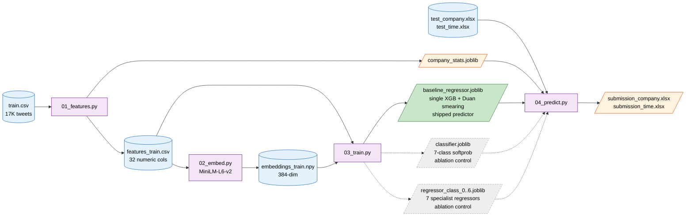

<div align="center">

# Task 1 — Tweet Likes Prediction

### *Likes Prediction on a 4 GB GPU*


[Pipeline](#pipeline) · [Methodology](#methodology) · [Results](#results) · [Reproduce](#reproduce)

</div>

---

## TL;DR

| | |
|---|---|
| **What** | Predict the number of likes a tweet will receive from its metadata `(date, content, username, media URL, inferred company)`. |
| **Approach** | Two candidates trained side-by-side on a leak-free regime-mirrored validation split: (a) a **7-band classify-then-regress cascade** (edges at 100, 250, 500, 1k, 2.5k, 5k likes, soft-routed), and (b) a **single XGBoost regressor with a Duan smearing correction**. The ablation picked the winner honestly: **the smeared single regressor beats the cascade** (val RMSE 2,240 vs 2,341) and is the shipped predictor. |
| **Result** | Test RMSE **621 (unseen brands)** / **1,861 (unseen time)** — combined **1,387** on 20K rows, median absolute error 137 likes, 53% of predictions within 2× of actual. |
| **Built for** | Google Developer Student Club, IIT Indore — Adobe Behaviour Simulation Challenge (Inter IIT Tech Meet, Mid Prep 2023). |

---

## Pipeline

The solid path is the shipped predictor; the dashed path is the cascade retained as a documented ablation control (see [The Ablation That Decided the Shipped Model](#the-ablation-that-decided-the-shipped-model)).



---

## Methodology

### The Insight
Likes follow a **power-law distribution** — median 73, max 254,931. A single model trying to fit the entire range gets pulled in different directions by very different regimes (common tweets vs. viral ones). The cascade design lets each regressor specialize in its own slice of the distribution.

### Bucket Definition (training-set quantiles)

| Class | Range | Train rows | Eval rows |
|---|---|---:|---:|
| **0 — Quiet** | likes < 100 | 9,127 (57%) | 483 |
| **1 — Low** | 100 ≤ likes < 250 | 2,374 (15%) | 245 |
| **2 — Mild** | 250 ≤ likes < 500 | 1,241 (8%) | 142 |
| **3 — Popular** | 500 ≤ likes < 1,000 | 1,435 (9%) | 147 |
| **4 — Very Popular** | 1,000 ≤ likes < 2,500 | 1,125 (7%) | 121 |
| **5 — Viral** | 2,500 ≤ likes < 5,000 | 404 (3%) | 61 |
| **6 — Mega-Viral** | likes ≥ 5,000 | 398 (2%) | 28 |

### Stage A — XGBoost Classifier
7-class softprob, class-weighted to counteract the long-tail imbalance (largest class has ~23× more rows than the smallest). Early stopping runs on an inner 10% slice of train; the regime-mirrored eval set is used only for reporting.

**Eval accuracy: 48.2%** on the leak-free split — above the 14% random baseline for 7 classes, but far below the 65% measured before the company-prior leak was fixed. That gap is itself informative: most of the classifier's earlier apparent skill came from leaked brand history, not from the tweet.

| Class | Precision | Recall | F1 |
|---|---:|---:|---:|
| 0 (quiet) | 0.582 | 0.874 | 0.699 |
| 1 (low) | 0.339 | 0.302 | 0.320 |
| 2 (mild) | 0.298 | 0.261 | 0.278 |
| 3 (popular) | 0.231 | 0.041 | 0.069 |
| 4 (very popular) | 0.398 | 0.372 | 0.385 |
| 5 (viral) | 0.000 | 0.000 | 0.000 |
| 6 (mega-viral) | 0.389 | 0.250 | 0.304 |

> Without leaked brand priors, the viral band is essentially unlearnable from metadata alone (0% recall) and the mid bands blur into their neighbours. This is why the cascade loses to the single regressor below: the routing signal is not strong enough to justify the added complexity.

### Stage B — Seven Specialist Regressors
Each XGBoost regressor sees only its bucket's rows during training, with `log1p(likes)` as the target. By specializing, each one learns its bucket's distribution tightly instead of trying to fit the whole range. The limitation is that at inference every specialist scores every row, including rows far outside its training range; soft routing weights that extrapolation by class probability rather than eliminating it.

### Soft Routing — The Inference Step
The naïve cascade picks `argmax(class_probs)` and uses only that bucket's regressor — **hard routing**. The problem: when the classifier is wrong, the row goes to a regressor that *never trained on its distribution*. Errors compound.

**Soft routing** weights *all seven* regressor predictions by class probability, in raw-likes space — the same rule in both `03_train.py` (validation) and `04_predict.py` (inference):

$$\hat{y} = \sum_{k=0}^{6} p(k \mid x) \cdot \texttt{expm1}(r_k(x))$$

For uncertain rows, regressor predictions get averaged out, giving graceful degradation. For confident rows, one term dominates, giving the same answer as hard routing. **Soft routing is hard routing's strict superset** when the classifier is calibrated.

### The Ablation That Decided the Shipped Model

Every architecture must beat the obvious baseline. On the leak-free validation split:

| Candidate | Val RMSE (raw likes) |
|---|---:|
| **Single XGB regressor + Duan smearing** (shipped) | **2,240.46** |
| Ensemble: 70% single / 30% cascade (log-space blend) | 2,244.13 |
| Cascade, soft-routed + per-tier smearing | 2,319.06 |
| Cascade, soft-routed (raw space) | 2,341.12 |
| Single XGB regressor (log target, no correction) | 2,419.30 |
| Single XGB regressor (tweedie, raw target) | 2,440.01 |
| Cascade, hard-routed | 2,451.24 |
| Cascade with a *perfect* classifier (oracle) | 2,110.82 |

Two follow-up experiments probed whether the cascade could be rescued. **Per-tier smearing** (each tier's regressor gets its own retransformation factor) improved it by only ~22 RMSE — the per-tier factors came out at 1.00–1.13 vs the single model's 1.72, showing that bucketing already acts as an implicit smearing correction and the cascade's true handicap is routing error (48% classifier accuracy). **Ensembling** the two smeared models lost at every blend weight, monotonically worsening as cascade weight grows — the cascade's errors are a noisier superset of the single model's (same features, same algorithm), so it contributes no complementary signal.

Two conclusions follow:
1. **Retransformation bias is real.** Training on `log1p(likes)` and inverting with `expm1` systematically underestimates the conditional mean. Duan's smearing factor (mean of `exp(residual)` on held-out data, here **1.724**) corrects it, contributing roughly 180 RMSE by itself.
2. **The oracle bounds the cascade's upside at approximately 6%.** Even a perfect classifier only reaches 2,110, so cascade engineering was never where the value was. The cascade is retained in the codebase (and as a debug column in the prediction CSVs) as a documented experiment.

---

## Feature Engineering

A clean OOP class (`TabularFeatureBuilder`) builds 32 numeric features. The same builder is imported by training and inference — drift between the two is impossible by construction.

### Cyclical Time
```python
self.df["hour_sin"]  = np.sin(2 * np.pi * hour / 24.0)
self.df["hour_cos"]  = np.cos(2 * np.pi * hour / 24.0)
# Same for day_of_week (period 7) and month (period 12)
```
Why: raw `hour=23` and `hour=0` look far apart to a tree split, but they're actually adjacent. Cyclical encoding preserves the wraparound.

### COVID Regime Flag
```python
self.df["is_post_covid"] = (self.df["date"] >= pd.Timestamp("2020-03-01")).astype(int)
```
Engagement patterns shift around March 2020. Explicit binary lets the model learn separate biases instead of having to discover the cutoff itself.

### Media Regex Parsing
The raw `media` column is `[Video(duration=14.0, views=12340, url='...')]`. We extract:
- `video_duration` and `video_views` (+ `log_video_views`)
- `has_photo` / `has_video` / `has_gif` binary flags

These are real engagement signals normally collapsed to a single `has_media=1/0` bit.

### Leave-One-Out Company Prior (anti-leakage)
The strongest tabular feature is "how popular is this brand on average?" The naïve mean leaks the row's own likes back into its feature. The fix:

```python
loo_mean = ((group_sum - row.log_likes) + prior · global_mean) / ((group_count - 1) + prior)
```

`SMOOTHING_PRIOR = 30` pulls small-brand estimates toward the global mean. **At test time, unseen brands cleanly fall back to the smoothed global mean** via the saved `company_stats.joblib`.

### Text Structure
Counts of `<mention>`, `<hyperlink>`, hashtags, emojis, exclamations, questions, caps words; char/word length; uppercase ratio.

### MiniLM Sentence Embedding
On top of the 32 hand features, we concatenate a 384-dim Sentence-Transformer embedding of the cleaned tweet text. **MiniLM-L6-v2** over heavier alternatives (BGE-Base, etc.) for 4 GB VRAM friendliness — 120 MB footprint, ~600 tweets/sec on CPU.

**Total feature vector: 32 + 384 = 416 dimensions per row.**

---

## Results

Test results are on the **20,000-row competition test set** (10K unseen brands + 10K unseen time period), graded against the supplied ground-truth likes (3 unseen-time rows with `likes = -1` excluded). Validation results are on the leak-free regime-mirroring split (1,227 rows: 379 from 10 fully held-out brands + 848 latest-date rows). Shipped predictor: **single XGB regressor + smearing**, selected on validation — never on test.

| Metric | Value |
|---|---:|
| **Test RMSE — Unseen Brands (10K rows)** | **620.83** |
| **Test RMSE — Unseen Time (10K rows)** | **1,861.01** |
| Combined test RMSE (20K rows) | 1,387.15 |
| Combined test MAE | 457.91 |
| Test median absolute error | 137 likes |
| Test predictions within 2× of actual | 53.2% |
| Test predictions within 5× of actual | 80.2% |
| Validation RMSE — shipped model | 2,240.46 |
| Validation RMSE — cascade (soft) | 2,341.12 |
| Validation classifier accuracy | 48.2% |

### Per-regime detail (shipped model vs. the cascade it replaced)

| Regime | Shipped RMSE | Cascade RMSE | Shipped MAE | Median pred (true) | Max pred (true) |
|---|---:|---:|---:|---:|---:|
| Unseen Brands | **620.83** | 1,242.27 | 350.39 | 453 (356) | 6,733 (1,863) |
| Unseen Time | **1,861.01** | 2,060.92 | 565.46 | 231 (291) | 18,519 (28,721) |

The validation-selected model won on test in **both** regimes, confirming the leak-free validation split as a reliable leaderboard proxy. Unseen brands improve the most (−50% RMSE vs. the cascade) because the smeared single regressor does not inherit the cascade's compounding routing errors on rows with no brand history. The remaining known weakness is over-prediction of the maximum on unseen brands (6,733 vs. a true maximum of 1,863); capping predictions by brand-history quantiles is the documented next step.

### Naive-baseline context

Constant predictors derived from the training set (median 73, mean 718), graded on the same test rows:

| Predictor | Unseen Brands RMSE | Unseen Time RMSE | Combined (20K) |
|---|---:|---:|---:|
| Predict train median | 398.9 | 2,551.6 | 1,826 |
| Predict train mean | 434.2 | 2,498.8 | 1,793 |
| **Shipped model** | **620.83** | **1,861.01** | **1,387** |

| Rank / calibration | Unseen Brands | Unseen Time |
|---|---:|---:|
| Spearman (model vs actual) | 0.02 | **0.72** |
| Log-RMSE — model / best constant | **0.986** / 1.081 | **1.528** / 1.781 |

Combined, the model beats the best constant by 23%. The two regimes tell different stories, and both should be told honestly: on **unseen time**, brand-history priors give the model real per-tweet ranking power (Spearman 0.72) and a 26% RMSE margin over any constant. On **unseen brands**, no per-tweet ranking signal exists in the metadata (Spearman ≈ 0.02 — virality is driven by follower counts and network effects that the data does not contain), so the model's value there is level calibration: it beats every constant on log-RMSE, while a constant wins on raw RMSE because that regime's true distribution is narrow (max 1,863). Any future model on this task should be benchmarked against these same constants first.

---

## Engineering Highlights

> Design decisions with the most direct impact on correctness and results.

### 1. Train/inference feature parity by construction
`TabularFeatureBuilder` is one class with an `is_train=True/False` flag — imported by both `01_features.py` and `04_predict.py`. If the training feature set changes, inference automatically reflects it. **It is structurally impossible** for the two paths to drift.

### 2. Regime-mirroring train/val split — now genuinely leak-free
The competition tests on **unseen brands** and **unseen time period**. We mirror both in the eval set: 5% of brands held out completely + latest 5% of remaining rows by date. Crucially, **all statistics (company priors, scaler) are recomputed from train rows only after the split**, so held-out-brand rows see exactly the global fallback that truly unseen brands get at test time. Fixing this leak moved classifier accuracy from an inflated 65% to an honest 48% — and made val RMSE actually predictive of test (the val-selected model won on both test regimes).

### 3. Leave-one-out smoothed company prior
Solves the row-level leakage in the naïve `company_avg_likes` feature, and provides clean fallback for unseen brands via the saved `company_stats.joblib`. During validation, priors are additionally rebuilt from train rows only (see #2) — LOO alone removes the row's own likes but not the brand's history.

### 4. Cyclical time + COVID flag + media regex
Three high-signal features. Cyclical encoding fixes the periodic-feature edge case; COVID flag captures a real distribution shift; media regex unlocks video duration and view count as engagement signals.

### 5. Ablation-driven model selection
The cascade (with soft routing) was the design bet; the single-regressor baseline was the control. On the honest split the control won — with the Duan smearing correction contributing ~180 RMSE by itself — so the control ships. Selecting on validation and reporting the losing candidate side-by-side is the discipline this repo demonstrates.

---

## Reproduce

```bash
cd Task-1
pip install -r requirements.txt

python 01_features.py     # ~30 sec, writes features_train.csv, models/company_stats.joblib
python 02_embed.py        # ~10 sec, writes embeddings_train.npy (GPU recommended)
python 03_train.py        # ~2 min, writes models/{classifier,regressor_0/1/2}.joblib
python 04_predict.py      # ~25 sec, writes outputs/submission_*.xlsx
```

**Hardware tested:** RTX 3050 Laptop, 4 GB VRAM, Windows 11.
**Total wall time:** ~4 minutes end-to-end.

---

## Repository Layout

```
Task-1/
├── README.md                                 you are here
├── requirements.txt
│
├── 01_features.py                           Phase 1: feature engineering
├── 02_embed.py                              Phase 2: MiniLM embeddings
├── 03_train.py                              Phase 3: classifier + 3 specialists
├── 04_predict.py                            Phase 4: cascade inference
│
├── data/
│   ├── train.csv                            17K tweets, ground-truth `likes`
│   └── test/
│       ├── behaviour_simulation_test_company.xlsx   10K rows, unseen brands
│       ├── behaviour_simulation_test_time.xlsx      10K rows, unseen time
│       └── content_simulation_test_*.xlsx           Task-2's test files (not used here)
│
├── models/                                  Trained artifacts (small, joblib)
│   ├── company_stats.joblib                 Per-brand priors for inference
│   ├── baseline_regressor.joblib            Shipped predictor (single XGB + smearing factor)
│   ├── classifier_model.joblib              Stage A — 7-class XGB classifier
│   ├── regressor_class_0.joblib             Stage B — quiet band (< 100 likes)
│   ├── regressor_class_1.joblib             Stage B — low band (100-250)
│   ├── regressor_class_2.joblib             Stage B — mild band (250-500)
│   ├── regressor_class_3.joblib             Stage B — popular band (500-1k)
│   ├── regressor_class_4.joblib             Stage B — very popular band (1k-2.5k)
│   ├── regressor_class_5.joblib             Stage B — viral band (2.5k-5k)
│   ├── regressor_class_6.joblib             Stage B — mega-viral band (5k+)
│   ├── class_bins.joblib                    7-bucket edges [100, 250, 500, 1k, 2.5k, 5k]
│   ├── feature_cols.joblib                  Feature order for inference
│   ├── tabular_scaler.joblib                StandardScaler fit on tabular block
│   └── metrics.json                         Machine-readable val metrics
│
└── outputs/
    ├── submission_company.xlsx              Final submission — unseen brands
    ├── submission_time.xlsx                 Final submission — unseen time
    ├── predictions_company.csv              Per-row predictions + class probs (debug)
    └── predictions_time.csv
```

---

## Acknowledgements

- **Adobe Digital Experience** + **Inter IIT Tech Meet (Mid Prep 2023)** — for the problem and dataset
- **dmlc/xgboost** — for the regressor and classifier
- **HuggingFace** — for `sentence-transformers/all-MiniLM-L6-v2`

Dataset is open-source. IP of the final solution belongs to Adobe per the challenge terms.
