<div align="center">

# Task 2 — Tweet Content Generation

### Brand-Aware Tweet Generation on a 4 GB Laptop GPU

*Fine-tuned **Qwen2.5-1.5B** with **QLoRA** to generate marketing tweets from metadata alone — running entirely on an RTX 3050 Laptop (4 GB VRAM).*

[](https://www.python.org/)
[](https://pytorch.org/)
[](https://huggingface.co/transformers)
[](https://github.com/huggingface/peft)
[](https://github.com/huggingface/trl)
[](LICENSE)

[Pipeline](#pipeline) · [Sample Outputs](#sample-outputs) · [Architecture](#architecture-decisions) · [Results](#results) · [Reproduce](#reproduce)

</div>

---

## TL;DR

| | |
|---|---|
| **What** | Generates a brand-appropriate tweet given only `(company, timestamp, target_likes, media_url)`. |
| **How** | Vision-Language Model captions the image → Qwen2.5-1.5B fine-tuned via **QLoRA** writes the tweet → beam search decodes. |
| **Why this is difficult** | Fitting 1.5B parameters plus optimizer state and activations into **4 GB of VRAM**. Required 4-bit NF4 quantization, paged 8-bit AdamW, gradient checkpointing, and a custom **VRAMGuard** callback. |
| **Built for** | Google Developer Student Club, IIT Indore — Adobe Behaviour Simulation Challenge (Inter IIT Tech Meet, Mid Prep 2023). |

---

## Sample Outputs

> Real generations from our fine-tuned model on **brands and time periods it never saw during training**.

<table>
<tr>
<td width="50%" valign="top">

#### Unseen Brands

> **BlackBerry** *(tech / launch)*
> *"We're excited to announce the launch of the #BlackBerry 1000, the world's first #5G mobile device. Learn more: `<hyperlink>`"*

> **UPMC** *(medical / awards)*
> *"`<mention>` has been named the 2020 recipient of the American Academy of Neurology's Distinguished Service Award. `<hyperlink>`"*

> **Coach** *(fashion / personal)*
> *"`<mention>` `<mention>` I'm so proud of you! `<hyperlink>`"*

</td>
<td width="50%" valign="top">

#### Unseen Time Period

> **CNN** *(news / political)*
> *"President Donald Trump says he is 'very happy' with the results of the 2020 U.S. presidential election `<hyperlink>`"*

> **Alcoa** *(industrial / awards)*
> *"We are proud to announce that `<mention>` has been selected as one of the finalists for the 2020 `<mention>`. `<hyperlink>`"*

> **Independent** *(news / breaking)*
> *"Ukrainian President Volodymyr Zelenskyy says he is ready to meet with Russian President Vladimir Putin `<hyperlink>`"*

</td>
</tr>
</table>

**Observations the model learned correctly:**
- Tweet structure (`<mention>`, `<hyperlink>` placeholders, hashtags)
- Brand-appropriate register (formal for awards, casual for fashion, headline-style for news)
- Hashtag conventions (`#BlackBerry`, `#5G`, `#UCLATeam`)
- Concise length (avg 12.8–15.8 words per tweet)

---

## Pipeline

```mermaid
flowchart LR
    A[(train.csv<br/>17.3K tweets)] -->|"Stage 1"| B[enrich_vlm.py<br/>Qwen2.5-VL-3B<br/>4-bit NF4]
    B --> C[(train_enriched.csv<br/>+ image captions)]
    C -->|"Stage 2"| D[prep_llm_data.py<br/>ChatML prompts]
    D --> E[(llm_train_data.jsonl)]
    E -->|"Stage 3"| F[finetune_qwen.py<br/>QLoRA r=16<br/>3 epochs]
    F --> F2[select_checkpoint.py<br/>Stage 3b: pick best<br/>by BLEU/ROUGE]
    F2 --> G[/Trained LoRA<br/>adapter/<br/>~8 MB/]
    H[(test_unseen_brands.csv<br/>test_unseen_time.csv)] --> I
    G -->|"Stage 4"| I[eval.py<br/>beam search n=4]
    I --> J[/submission.csv/]

    style A fill:#e3f2fd,stroke:#1565c0,color:#000
    style C fill:#e3f2fd,stroke:#1565c0,color:#000
    style E fill:#e3f2fd,stroke:#1565c0,color:#000
    style H fill:#e3f2fd,stroke:#1565c0,color:#000
    style G fill:#fff3e0,stroke:#e65100,color:#000
    style J fill:#fff3e0,stroke:#e65100,color:#000
    style B fill:#f3e5f5,stroke:#6a1b9a,color:#000
    style D fill:#f3e5f5,stroke:#6a1b9a,color:#000
    style F fill:#f3e5f5,stroke:#6a1b9a,color:#000
    style F2 fill:#f3e5f5,stroke:#6a1b9a,color:#000
    style I fill:#f3e5f5,stroke:#6a1b9a,color:#000
```



---

## Architecture Decisions

> Each choice traded off VRAM, speed, and quality. Recommended path **bolded**.

| Decision | **Choice** | Alternatives considered | Rationale |
|---|---|---|---|
| **Base LLM** | **Qwen2.5-1.5B-Instruct** | Mistral-7B, Llama-3-8B, Flan-T5-base (250 M) | 7B+ OOMs on 4 GB even with QLoRA. 250 M underfits free-text generation. |
| **VLM** | **Qwen2.5-VL-3B-Instruct** | Florence-2-large, BLIP-2 | Best scene understanding + OCR for lifestyle marketing imagery. Shares tokenizer family with base LLM. |
| **Quantization** | **4-bit NF4 (bitsandbytes)** | 8-bit, fp16, full precision | Only path that fits 1.5B + LoRA + activations + paged optimizer in 4 GB. |
| **Adapter** | **LoRA r=16, α=32**, q/k/v/o projections | Full fine-tune, prefix tuning, IA³ | ~7 M trainable params (0.5% of base). Rank 16 saturates quality for 1.5 B models. |
| **Optimizer** | **`paged_adamw_8bit`** | AdamW, SGD-Momentum | Pages momentum/variance to CPU pinned memory. Without paging, optimizer state alone exceeds VRAM. |
| **Activations** | **Gradient checkpointing ON** | Off | Saves ~30% activation memory at the cost of one extra forward per backward. |
| **Decoding** | **Beam search (n=4, no_repeat_ngram=3)** | Nucleus sampling, greedy | BLEU/ROUGE/CIDEr reward overlap with a *single* reference — the mode of the distribution is the better target. |
| **Train/Val split** | **Regime-mirroring**: 5% brands held-out + 5% latest dates held-out | Random 80/20 | Eval loss now correlates with leaderboard objective, not in-distribution loss. |
| **Sequence length** | **256 tokens** | 512, 1024 | Median tweet is 26 tokens. 256 covers >99.5%, doubles speed/VRAM headroom. |

---

## Results

| Metric | Step 50 | Step 500 | Step 1000 (shipped) | Step 1150 |
|---|---:|---:|---:|---:|
| **Train loss** | 3.24 | 1.41 | 1.16 | **1.13** |
| **Eval loss** | — | 1.093 | **1.080**  | — |
| **Token accuracy** | — | 78.25% | **77.96%** | 77.98% |
| **Eval entropy** | — | 1.313 | 1.140 | — |

**Best checkpoint:** `checkpoint-1000` (shipped in `adapter/`), selected by eval_loss.

> **Notes on this table.** The planned schedule was 3 epochs (approximately 3,087 optimizer steps); the logged run covers steps up to 1,150 (approximately 1.1 epochs). Checkpoint selection by eval_loss is a known weakness, since token-level loss is dominated by templated tokens and does not track BLEU/ROUGE. `src/select_checkpoint.py` now scores saved checkpoints by actual generation metrics; use it after any re-training run.

### Fine-tuned vs base model (seeded random 500 rows/regime, identical prompts + decoding)

| Metric (brands / time) | Base Qwen2.5-1.5B | Fine-tuned |
|---|---:|---:|
| BLEU-1 | 0.0754 / 0.0832 | **0.1762 / 0.1327** |
| ROUGE-L | 0.0781 / 0.0861 | **0.2131 / 0.1850** |
| CIDEr | 0.0139 / 0.0147 | **0.0861 / 0.0806** |
| Eval perplexity (held-out tweets, same split) | 53.49 | **3.33** |
| Avg generation length (refs 16.5 / 19.3 words) | 26.9 / 30.4 | 13.7 / 13.8 |

Fine-tuning roughly doubles-to-triples every overlap metric — bootstrap 95% CIs do not overlap on any of them — and teaches the model tweet-appropriate brevity. Reproduce with `src/eval.py` (fine-tuned), `NO_ADAPTER=1 src/eval.py` (base), `src/eval_base_loss.py` (perplexity), and `score_vs_gt.py` (scoring vs the answer keys).

### Generation Statistics (100-sample inference)

| Test regime | Avg words / tweet | Hashtag rate | Avg `<mention>` per tweet |
|---|---:|---:|---:|
| Unseen brands | 12.8 | 0.31 | 1.47 |
| Unseen time period | 15.8 | 0.22 | 1.05 |

---

## Engineering Highlights

> The non-obvious design decisions that made this pipeline run on 4 GB of VRAM.

### 1. VRAMGuard callback — `gc.collect()` *only* at the edge

The naive solution is `torch.cuda.empty_cache()` after every step. That **hurts throughput** (10 s/it rising to 14 s/it) because PyTorch loses its allocator cache. Our callback fires only when reserved memory crosses 98%:

```python
class VRAMGuardCallback(TrainerCallback):
    def on_step_end(self, args, state, control, **kwargs):
        pct = torch.cuda.memory_reserved(0) / torch.cuda.get_device_properties(0).total_memory * 100
        if pct >= 98:
            gc.collect()
            torch.cuda.empty_cache()   # only when actually needed
```

In practice this fires every 1–3 steps during peak, and keeps the run stable for the full 3-epoch / 3087-step schedule.

### 2. Regime-mirroring eval split

The competition tests **unseen brands** *and* **unseen time periods**. We mirror both regimes in the eval set:

```python
eval = (all rows from 5% randomly held-out brands)
       ∪
       (latest 5% of rows from remaining brands by date)
```

Result: eval loss now drops in lockstep with leaderboard improvement instead of being a random in-distribution sample.

### 3. Train/inference prompt parity

Both `prep_llm_data.py` and `eval.py` import the same `build_messages()` from `prompt_utils.py`. Drift between the two is the most common silent regression in instruction-tuned LMs — a one-token difference in formatting can drop BLEU by 5+ points.

### 4. Sequential VLM → LLM loading (never co-resident)

```
   load VLM (Qwen2.5-VL-3B, ~2 GB)
        │
        ▼
   caption all needed images
        │
        ▼
   del VLM + torch.cuda.empty_cache()    (frees ~2 GB)
        │
        ▼
   load LLM (Qwen2.5-1.5B + LoRA, ~2 GB)
```

Without this, both models would attempt to coexist in 4 GB — guaranteed OOM.

### 5. Graceful degradation for dead URLs

99.8% of training media URLs return 404 (old Twitter media expires). The prompt format includes the image-caption line **only when** a valid caption was obtained, so the model learned to write tweets *with or without* visual context.

At inference, `eval.py` now runs a fast concurrent URL-liveness check (HEAD requests, 16 workers) and only loads the VLM if any media is actually alive — dead links cost milliseconds instead of a 10 s timeout each. This matters most on the **unseen-time** test set, whose recent media is far more likely to still exist. Set `SKIP_VLM=1` to disable entirely.

---

## Reproduce

```bash
# 1. Clone & install
git clone https://github.com/havish-coder/Tweet_analyzer.git
cd Tweet_analyzer/Task-2
pip install -r requirements.txt

# 2. Run inference with the shipped LoRA adapter (no training needed)
python src/eval.py
# outputs/submission_unseen_brands.csv
# outputs/submission_unseen_time.csv

# Useful env flags for eval.py:
# SAMPLE_SIZE=0       full test files (default: random 500/regime, seeded)
# SKIP_VLM=1          skip media captioning (default: on, gated by URL liveness)
# USE_RETRIEVAL=1     few-shot brand examples in prompt (A/B only — the shipped
# adapter was fine-tuned WITHOUT examples)
# GEN_BATCH=8         generation batch size (batched, left-padded)
# LENGTH_PENALTY=1.1  nudges beam search toward reference-length tweets

# 3. (Optional) reproduce the full training pipeline from scratch
python src/enrich_vlm.py           # Stage 1: image captions  (~6 h on 4 GB GPU)
python src/prep_llm_data.py        # Stage 2: build JSONL     (<1 min; add EXAMPLES_IN_TRAIN=1 for few-shot prompts)
python src/finetune_qwen.py        # Stage 3: QLoRA fine-tune (~18 h on RTX 3050)
python src/select_checkpoint.py    # Stage 3b: pick checkpoint by BLEU/ROUGE, not eval_loss
python src/eval.py                 # Stage 4: inference + submission
```

> **Hardware tested:** NVIDIA RTX 3050 Laptop, 4 GB VRAM, Windows 11.
> **Inference cost:** ~5–10 minutes for 200 test rows on the same GPU.

---

## Repository Layout

```
Task-2/
├── README.md                     you are here
├── explain.md                   Interview-prep cheat sheet (Q&A format)
├── requirements.txt             pinned deps
│
├── src/                         the pipeline
│   ├── enrich_vlm.py            Stage 1 — Qwen2.5-VL-3B captioning
│   ├── prep_llm_data.py         Stage 2 — ChatML JSONL builder (id-tagged records)
│   ├── prompt_utils.py          shared prompt template (train ≡ infer)
│   ├── finetune_qwen.py         Stage 3 — QLoRA fine-tuning loop
│   ├── select_checkpoint.py     Stage 3b — checkpoint selection by BLEU/ROUGE
│   ├── gen_metrics.py           BLEU/ROUGE/CIDEr + bootstrap CIs (shared)
│   └── eval.py                  Stage 4 — batched beam-search inference + submission
│
├── data/                        all CSVs / JSONL
│   ├── train.csv                17.3 K raw tweets
│   ├── train_enriched.csv       + VLM captions
│   ├── llm_train_data.jsonl     ready-to-train ChatML
│   ├── test_unseen_brands.csv   10 K rows, brands unseen in training
│   └── test_unseen_time.csv     10 K rows, latest time period
│
├── adapter/                     trained LoRA (inference-ready, ~20 MB)
│   ├── adapter_model.safetensors    the 7 M trained parameters
│   ├── adapter_config.json
│   ├── chat_template.jinja
│   ├── tokenizer.json
│   └── tokenizer_config.json
│
├── outputs/                     generated submissions
│   ├── predictions_unseen_brands.csv    full row + generated + actual
│   ├── predictions_unseen_time.csv
│   ├── submission_unseen_brands.csv     competition format
│   └── submission_unseen_time.csv
│
└── docs/
    ├── DEEP_DIVE.md             34-page technical write-up
    └── progress.md              session-by-session change log
```

---

## Tech Stack

<div align="center">

[](https://pytorch.org)
[](https://huggingface.co)
[](https://github.com/huggingface/peft)
[](https://github.com/huggingface/trl)
[](https://github.com/TimDettmers/bitsandbytes)
[](https://huggingface.co/Qwen)

</div>

---

## Acknowledgements

- **Adobe Digital Experience** & **Inter IIT Tech Meet (Mid Prep 2023)** — for the problem statement and dataset.
- **Qwen team @ Alibaba** — for the Qwen2.5 model family.
- **Hugging Face** — for `transformers`, `peft`, `trl`, and the model hub.
- **Tim Dettmers et al.** — for QLoRA and `bitsandbytes`.

## License

[MIT](LICENSE) for the code in this repository. The final solution IP belongs to Adobe per the challenge terms. Dataset is open-source and was sampled from public Twitter enterprise accounts.
